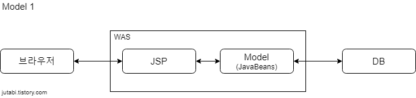
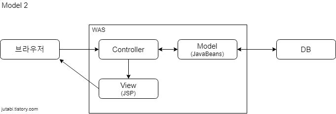

# MVC (Model View Controller)

### Model
- 백그라운드에서 동작하는 로직을 처리
- 사용자에게 정보를 요청받으면 정보를 처리하는 역할  
(ex) 사진의 글자를 OCR 해주세요 ->  
사진을 OCR)

### View
- 사용자가 보게될 결과 화면 (ex) .jsp)
- 사용자에게 정보를 요청받으면 정보를 보여준다.
(ex) 사진의 글자를 OCR 해주세요 ->  
Model에서 처리한 결과를 사용자에게 전달한다.)

### Controller
- 사용자의 입력 처리와 흐름 제어 담당
(ex) 사진의 글자를 OCR 해주세요 (test.com/crop) ->  
test.com 웹서버에게 사진을 크롭해주길 요청하면 crop 기능을 수행하는 Model에게 사진을 전달한다.)

## MVC 설계 방식

### Model 1

- 사용자의 요청을 JSP가 전부 처리합니다.

### Model 2

1. 요청을 컨트롤러가 처리합니다.
2. 요청에 대한 적절한 기능(Model)을 모델에서 찾아 Model에게 기능 수행을 요청합니다.
3. Model이 수행한 결과를 .jsp 파일(View)에 담아 사용자에게 응답합니다.  

- JSP 에서 모든 기능을 구현하지 않고 요청 처리, 기능 구현, View 단을 분리하여 구성합니다.
- 분리 구성을 함으로 분업에 유용합니다.
- JSP 가 사용자에게 보여줄 정보만을 처리하면 됨으로 깔끔합니다.

## 스프링에서의 MVC 처리 과정
