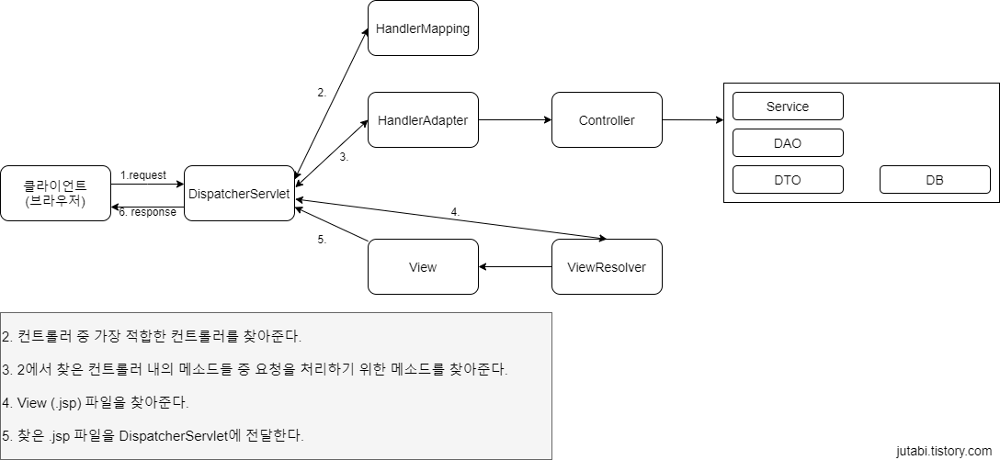

# 스프링
- 자바 기반의 웹 프레임워크이다.
- 동적인 웹 사이트를 개발한다. (WAS 이용)
### 스프링의 주요 기능
- [DI (Dependency Injection, 의존성 주입)](./Spring/DI.md)
- [IoC (Inversion of Control, 제어의 역전)](./Spring/IoC.md)
- [AOP (Aspect Oriented Programming, 관점 지향 프로그래밍)](./Spring/AOP.md)
- [POJO (Plain Old Java Object)](./Spring/POJO.md)
- [MVC (Model View Controller)](./Design%20Pattern/Model_View_Controller.md)
### 처리 과정
#### 개략

1. 클라이언트가 한 웹 페이지에 대해서 서버에 요청을 보낸다.
2. DispatcherServlet 이 요청을 받아 HandlerMapping 에게 적합한 컨트롤러를 찾게한다.
3. 찾은 컨트롤러를 이용하여 DispatcherServlet 은 HandlerAdapter 에게 컨트롤러 내의 적합한 메소드를 찾게 한다.
4. 메소드에서 반환하는 값을 이용하여 ViewResolver 는 .jsp 파일을 찾는다.
5. DispatcherServlet 은 찾은 .jsp 파일을 사용자에게 응답한다.
  
#### 실제 처리 과정

1. 사용자가 jutabi.com/member/join 주소를 요청한다.
2. 요청한 uri를 통하여 먼저 "/member" 로 RequestMapping 되어 있는 컨트롤러를 찾는다.  
2.1 찾은 컨트롤러 내의 "/join" 으로 RequestMapping 되어 있는 메소드를 찾는다.
3. ViewResolver 는 찾은 메소드 (joinForm()) 메소드가 반환하는 값 ("joinForm")을 통해 joinForm.jsp 파일을 전달한다.
4. DispatcherServlet 은 joinForm.jsp 파일을 사용자에게 응답한다.