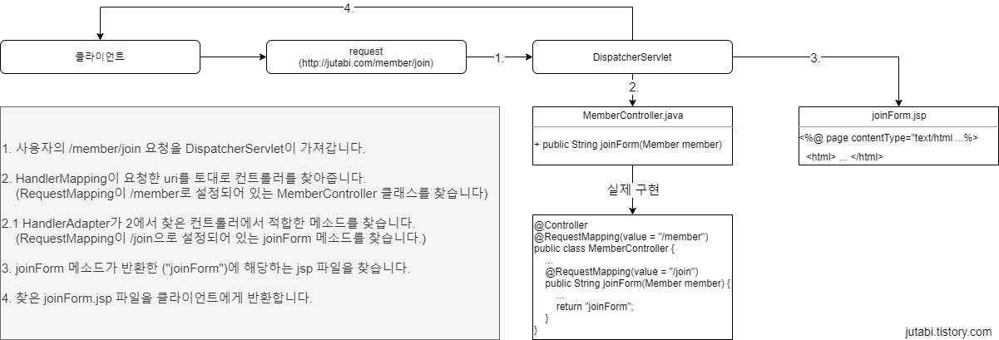

# 스프링
- 자바 기반의 웹 프레임워크이다.
- 동적인 웹 사이트를 개발한다. (WAS 이용)
### 스프링의 주요 기능
- DI (Dependency Injection, 의존성 주입)
- AOP (Aspect Oriented Programming, 관점 지향 프로그래밍)
- POJO (Plain Old Java Object)
- Ioc (Inversion of Control, 제어 반전)
- MVC (Model View Controller)
### 처리 과정

  
